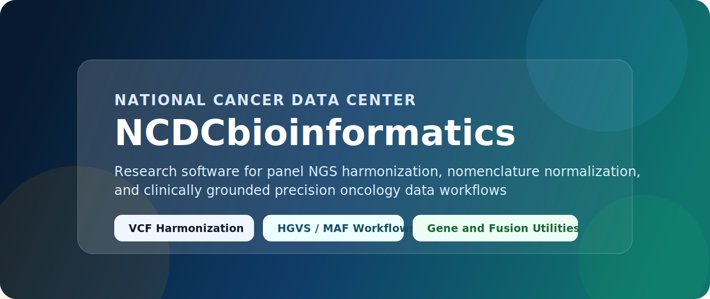

  

  
  
  

## About

`NCDCbioinformatics` is the public bioinformatics software profile of the National Cancer Data Center. The account is organized around two major development tracks:

- `CURE-NGS`: a panel-based genomic data construction and harmonization framework for heterogeneous clinical sequencing outputs
- `K-CORE`: analysis portal development for clinico-omics integration, visualization, and research-facing data exploration

## Main Projects

### CURE-NGS

`CURE-NGS` is the publication-facing framework for panel-based genomic data harmonization, transformation, and reproducible mutation annotation workflows.

| Repository | Purpose |
| --- | --- |
| [cure-ngs-panel-harmonization-framework](https://github.com/NCDCbioinformatics/cure-ngs-panel-harmonization-framework) | Umbrella repository for the manuscript, editorial declarations, and framework metadata |
| [panel_VCF_vcf2maf_pipeline](https://github.com/NCDCbioinformatics/panel_VCF_vcf2maf_pipeline) | Multi-panel VCF preprocessing, build harmonization, and VCF-to-MAF conversion |
| [HGVS_to_minimal_MAF_pipeline](https://github.com/NCDCbioinformatics/HGVS_to_minimal_MAF_pipeline) | HGVS-driven minimal MAF generation pipeline |
| [minimal_MAF_to_annotated_MAF_pipeline](https://github.com/NCDCbioinformatics/minimal_MAF_to_annotated_MAF_pipeline) | Minimal-MAF-to-annotated-MAF conversion pipeline |
| [gene_name_harmonization](https://github.com/NCDCbioinformatics/gene_name_harmonization) | Gene symbol harmonization utility |
| [gene_fusion_normalizer](https://github.com/NCDCbioinformatics/gene_fusion_normalizer) | Fusion gene normalization utility |
| [hgvs_normerlizer](https://github.com/NCDCbioinformatics/hgvs_normerlizer) | HGVS nomenclature normalization utility |

### K-CORE Analysis Portal Development

`K-CORE` represents the clinico-omics analysis portal development track, including backend services, frontend visualization, and synthetic demonstration resources. These repositories remain in their original source profile and are referenced here without modifying the original `K-CORE-NCDC` account.

| Project | Area | Summary |
| --- | --- | --- |
| [K-CORE profile](https://github.com/K-CORE-NCDC) | Portal overview | Public K-CORE analytic portal profile maintained separately from this account |
| [ncc-backend](https://github.com/K-CORE-NCDC/ncc-backend) | Backend platform | Django and Django REST backend for the K-CORE clinico-omics portal with PostgreSQL and SQLite workflows |
| [ncc-frontend](https://github.com/K-CORE-NCDC/ncc-frontend) | Frontend visualization | React-based portal UI for clinico-omics exploration and precision oncology visual analytics |
| [synthetic-data-set](https://github.com/K-CORE-NCDC/synthetic-data-set) | Demonstration data | Synthetic omics-oriented dataset package used for portal validation and demonstration |

## Focus Areas

- Panel-based genomic data construction and harmonization
- Provenance-aware transformation of VCF, HGVS, and report-derived inputs
- Research-ready mutation annotation workflows
- Clinico-omics portal engineering and interactive data visualization
- Terminology normalization for cancer genomics data integration

## Contact

- Institution: National Cancer Data Center
- Website: [www.cancerdata.re.kr](https://www.cancerdata.re.kr/)
- Location: Goyang-si, Gyeonggi-do, Republic of Korea

## Notes

The repositories under this profile are intended for research software and framework documentation. Patient-level clinical or genomic data are not distributed through this profile.
